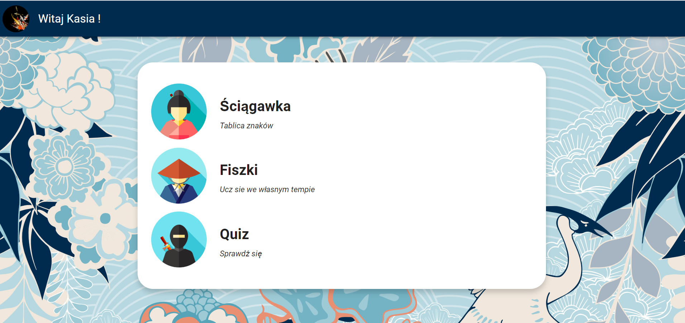
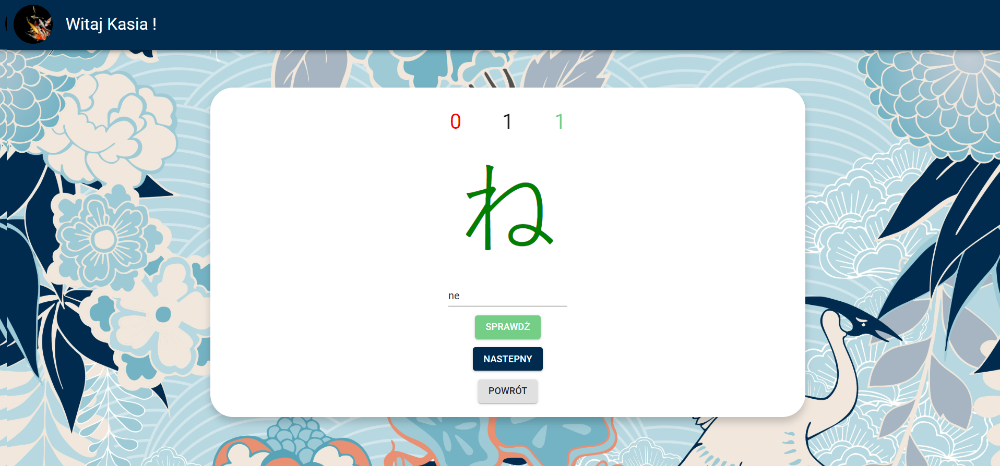
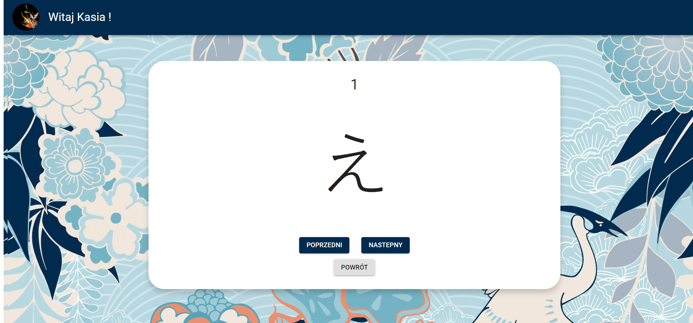

# Kana-App - black belt your skill!

## General

Application help users to learning japanese syllabaries : hiragana and katakana. Tools for learning includes cheat sheet, flash cards and quiz.

## User stories

- User can register/sign in and log out
- User can change its password if it forgets
- User can check its statistics includes time spending on quizes and correct answers accurancies per character
- User can add/change its avatar
- User can open app on mobile devices
- User can choose which syllabary it want to check itself during flash cards and quiz mode
- User can choose which characters it want to check itself: incorrect answers from last session (if it has) or all chosen syllabary

## Technologies

- React
- React - Redux
- Firebase - realtime database
- React UI Framework - Material UI
- SCSS

## Screenshots

## To see results locally

You need to install:

- `node.js` >=8.x
- `npm` >=5.x
- `react-dom` >= 16.3.x
- `firebase` >= 7.x
- `node-sass` >= 4.x
  Install depedencies by running `npm install`
  Run `npm start`

AND ENJOY!
